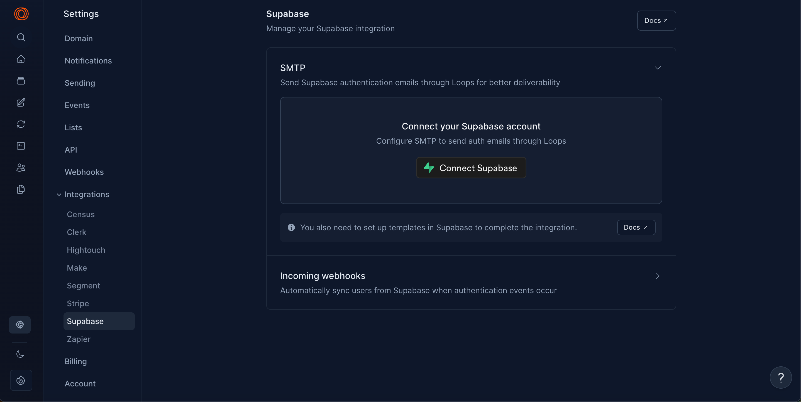
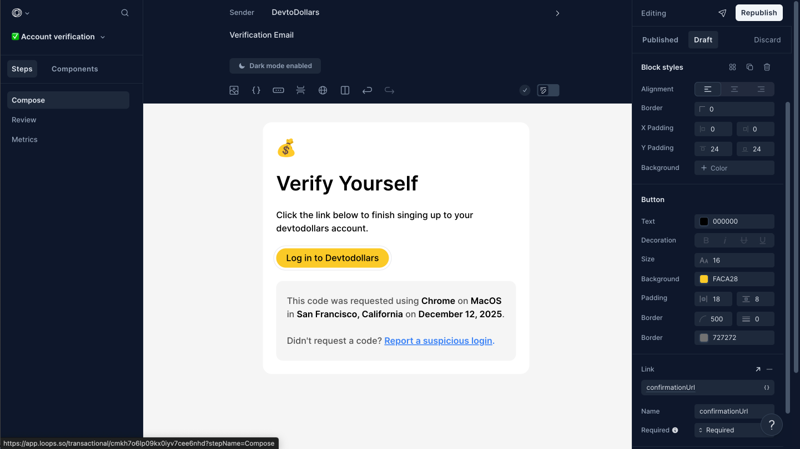

# Email (Loops)

## Setup

1. Buy a domain, I recommend [Cloudflare](https://developers.cloudflare.com/registrar/get-started/register-domain/)
2. Create a loops account and follow these [instructions](https://postmarkapp.com/support/article/1002-getting-started-with-postmark)
3. On [loops](https://loops.so/docs/smtp/supabase) go to settings under integrations and choose supabase: 

4. Then when you come back to the loops page select Setup SMTP
5. This should automatically setup your authentication service, you should be able to go to Supabase > Authentication > Email > SMTP Settings.
6. You need to setup your domain settings before being able to send emails through loops, navigate to [https://app.loops.so/sending-domain](https://app.loops.so/sending-domain) add the required records in your DNS settings of your personal domain. 
7. Now its time for creating a template, navigate to [https://app.loops.so/templates](https://app.loops.so/templates) and select the account verification template.
8. Design the template to match your website’s branding.
9. After your design is done you can press publish. Note that you have to setup your domain before this stage, if you don’t the Publish button is gonna remain inactive. 
10. At this step you connect your email template in supabase. Navigate to your supabase project, then click the Authentication Section on the left side, after that select Confirm Sign up button.
11. In the body you need to fill the following vairables
```
{
  "transactionalId": "cmkh7o6lp09kx0iyv7cee6nhd",
  "email": "{{ .Email }}",
  "addToAudience": true,
  "dataVariables": {
    "confirmationUrl": "{{ .ConfirmationURL }}"
  }
}
```
Note: you can get the email template id from the url of the specific transaction on loops, for example: [https://app.loops.so/transactional/cmkh7o6lp09kx0iyv7cee6nhd](https://app.loops.so/transactional/cmkh7o6lp09kx0iyv7cee6nhd) 
12. Inside the email template on loop click on the button, then press the data variable field next to Link and add confirmationURL there, this is the confirmationURL that will be sent from the supabase url.

13. Next go to [https://app.loops.so/settings](https://app.loops.so/settings) and to the API Keys section, then select the key and paste the key inside the root .env file’s LOOPS_API_KEY file. 

You are all done now.
