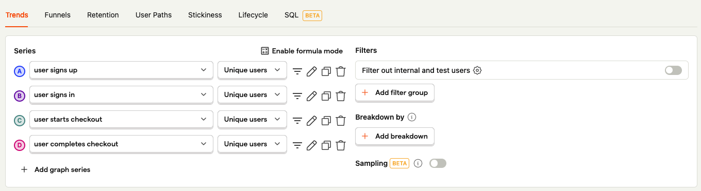
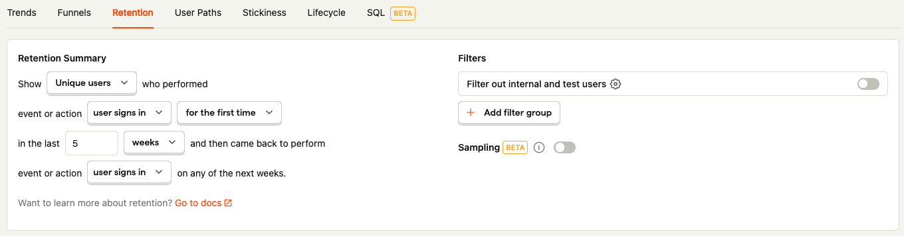

# Capture Basic Analytics

Here are 3 basic metrics you want to measure: **Retention, Conversion,  DAUs, and Revenue**. This will give you a good overview on how your product is fairing overtime. It is highly recommended to have product analytics so you are informed on how well the product is doing. For revenue related metrics use the [Stripe dashboard](https://dashboard.stripe.com/dashboard)

For more advice on what sort of metrics to measure and when to add more, watch this [video by YC](https://www.youtube.com/watch?v=LLerCc7MOQo).

1. Create a new dashboard
2. Add DAUs graph to dashboard

3. Add conversion graph to dashboard

3. Add  retention graph to dashboard

