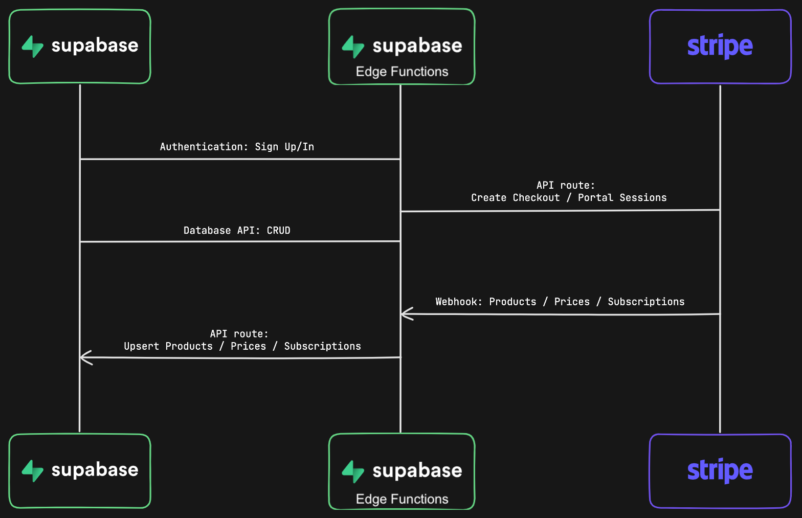

# Payments (Stripe)
The stripe component of this boilerplate is very similar to the official [nextjs-subscription-payments](https://github.com/vercel/nextjs-subscription-payments?tab=readme-ov-file) repository. The only difference is that the sync uses [Supabase edge functions](https://supabase.com/docs/guides/functions) instead of [Vercel functions](https://vercel.com/docs/functions). 

The advantage using Supabase edge function provides is that it:
1. Leverage Supabase' generous pricing
2. Allows us to keep the server side logic within Supabase in case we wanted to switch off of Vercel.
## Architecture

