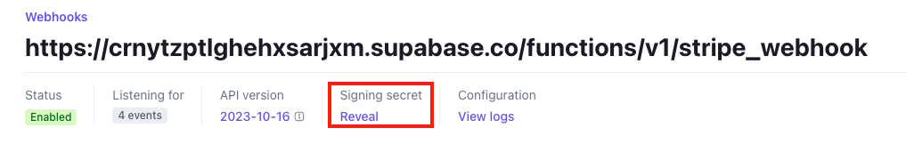

# Setup
We'll need to configure [Stripe](https://stripe.com/) to handle test payments. If you don't already have a Stripe account, create one now.

For the following steps, make sure you have the ["Test Mode" toggle](https://stripe.com/docs/testing) switched on:

1. Create a stripe account and [set it up](https://support.stripe.com/topics/getting-started)
2. [Create a product](https://support.stripe.com/questions/how-to-create-products-and-prices)
3. Go to [portal settings](https://dashboard.stripe.com/settings/billing/portal) and click "Save Changes"
4. Go to Supabase dashboard > Edge Functions and copy the `stripe_webhooks` URL. It should look something like below:


5. [Add stripe webhook](https://docs.stripe.com/webhooks#add-a-webhook-endpoint), 
6. Click `Select events` under the `Select events to listen to` heading.
7. Click `Select all events` in the `Select events to send` section.
8. Copy `Signing secret` as we'll need that in the next step (e.g `whsec_xxx`)

9. Get your [Stripe API secret key](https://support.stripe.com/questions/locate-api-keys-in-the-dashboard) and update `STRIPE_SECRET_KEY` in `.env`
10. Get the signing webhook signing secret and update `STRIPE_WEBHOOK_SIGNING_SECRET` in `.env`
11. Set your secrets in production

```bash
supabase secrets set --env-file .env
```

:::info
You can follow steps 1-7 in the [Stripe test environment](https://docs.stripe.com/test-mode) to have your local environment use the stripe test environment. Update `.env.local` instead of `.env`.
:::

:::note
After setting up the webhooks, you can run the command below to do an initial sync between your supabase and stripe database
```
deno run  -A supabase/functions/_scripts/sync-stripe.ts
```
:::