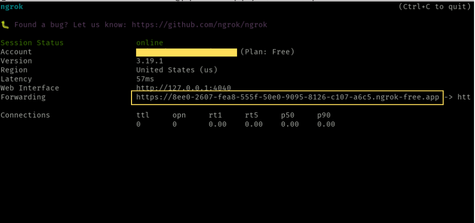

# Test Stripe Connect Webhook locally
If you are using Stripe Connect, you will now have two stripe webhooks to listen to. However, each of these webhooks need to have a different signing secret. If you use the [Stripe CLI](https://stripe.com/docs/stripe-cli) the same way we used it on [Test Webhooks](./test-webhooks.md), you will get the same signing secret for both webhooks. This results in stripe connect webhooks and stripe webhooks leaking events to one another.

To fix this issue, we use [Ngrok](https://ngrok.com/) to create a secure tunnel to our local webhook server:

1. [Download Ngrok](https://download.ngrok.com/downloads/linux) and install it on your machine.

2. Spin up a tunnel using ngrok. The tunnel will forward stripe webhook and connect webhook to your supabase edge functions:
```
ngrok http 54321
```


3. Navigate to the [Stripe Dashboard](https://dashboard.stripe.com) search for webhooks in the search bar. Connect two seperate endpoints from the url provided by ngrok as highlighted in the image above. You need to create two seperate webhooks for the stripe connect and stripe webhooks: 
```
https://<ngrok-url>/functions/v1/stripe_connect_webhook
https://<ngrok-url>/functions/v1/stripe_webhook 
```
4. Finally, copy the signin secrets for each of the webhooks and paste them into your supabase .env file as `STRIPE_CONNECT_WEBHOOK_SECRET` and `STRIPE_WEBHOOK_SECRET` respectively. Note that the two secrets should be different from each other. 
