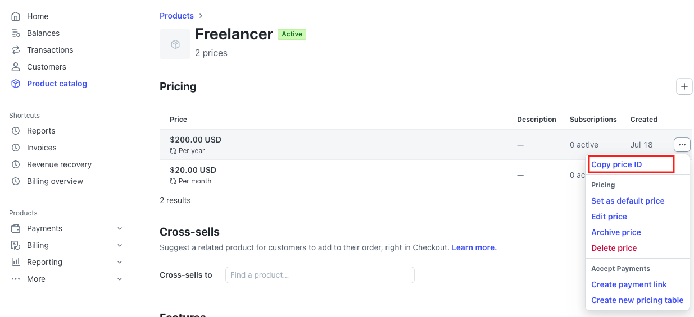

# Update Pricing Page
## Setup
To update the pricing, page you'll need to
1. Get the Stripe price id. Which would be under a product in `Product Catalog` under `Pricing`.

2. In order to get the checkout section, you'll need to call the [`get_stripe_url`](https://github.com/devtodollars/mvp-boilerplate/blob/main/supabase/functions/get_stripe_url/index.ts) webhook in Supabase with the price copied from the previous step set as the `priceId`
3. This will retrieve a checkout URL with the price preconfigured.

## Examples
- How I setup the redirect in Flutter in [payments_screen.dart](https://github.com/devtodollars/mvp-boilerplate/blob/main/flutter/lib/screens/payments_screen.dart)
- How I setup the redirect in NextJS in [Pricing.tsx](https://github.com/devtodollars/mvp-boilerplate/blob/main/nextjs/components/landing/Pricing.tsx)
