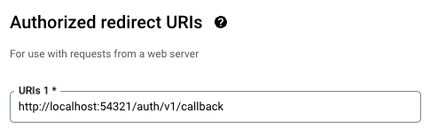

# Configure Authentication
Below are quick guides for configuring authentication with the boilerplate. Most apps will do fine with email only but here are also instructions for social sign ins (e.g. Google, Github).

## Setup Email

1. Go to Supabase dashboard >  Authentication > Providers, and enable email authentication
2. Enable email verification. If disabled make sure to remove [email verification dialog](https://github.com/devtodollars/flutter-supabase-production-template/blob/main/flutter/lib/components/email\_form.dart#L69) in the code.
3. Under Authentication > URL Configuration, adjust the site URL to your app url.

## Setup Social Sign Ins

### Setup Google & Github OAuth

1. Setup [Google OAuth for Flutter](https://supabase.com/docs/guides/auth/social-login/auth-google?platform=flutter#google-sign-in-for-ios-and-android)
2. Setup [Github OAuth](https://supabase.com/docs/guides/auth/social-login/auth-github)

:::warning
Make sure to update redirect URLs under Authentication > URL Configuration for all URLs. For example, that would look like:

* `http://localhost:*`
* `https://app.devtodollars.com`
* `https://**--devtodollars.netlify.app`
:::

### Configure for local development

1. Create a `.env` file in the project root directory by copying the `.env.example`

```
cp .env.example .env
```

2. Update the environment variables with the variables created from the previous step.
3. For the `Authorized Redirect` for Google, ensure to add `http://localhost:54321/auth/v1/callback`




