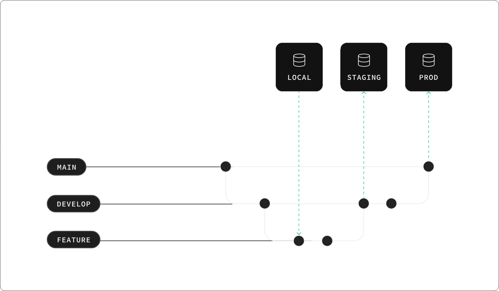

# Release (Supabase Github App)
We run our deployments following best practices from [Supabase Managing Environments](https://supabase.com/docs/guides/cli/managing-environments).

Then, we follow [database branching](https://supabase.com/docs/guides/platform/branching) to handle the deployments