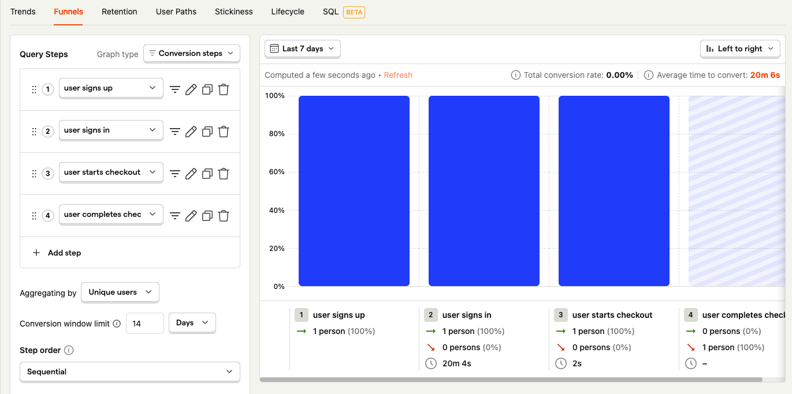

# Analytics (Posthog)

## Setup

1. Create an account in [Posthog](https://posthog.com/) and get your posthog client key. It should look something like: `phc_XXXXXXXXXXXXXXXXXXXXXXXXXXXXXXXXXXXX`
2. Update the posthog client key in the following places:
   1. [flutter/web/index.html](https://github.com/devtodollars/flutter-supabase-production-template/blob/main/flutter/web/index.html#L45)
   2. [flutter/ios/Runner/Info.plist](https://github.com/devtodollars/flutter-supabase-production-template/blob/main/flutter/ios/Runner/Info.plist#L51)
   3. [flutter/macos/Runner/Info.plist](https://github.com/devtodollars/flutter-supabase-production-template/blob/main/flutter/macos/Runner/Info.plist#L34)
   4. [flutter/android/app/src/main/AndroidManifest.xml](https://github.com/devtodollars/flutter-supabase-production-template/blob/main/flutter/android/app/src/main/AndroidManifest.xml#L31)
3. Setup [Stripe test environment](payments.md#setup) and setup [Supabase local development](backend/supabase-local-development.md)
4. Run a local version and simulate the following events
   1. `user signs in` -> login to the application
   2. `user signs up` -> sign up for the application
   3. `user starts checkout` -> Craft your [checkout url](payments.md#updating-your-pricing-page) (e.g. `localhost:XXXXX/payments?price=price_XXXXX)` which will create a checkout sesssion but in localhost.
   4. `user completes checkout` -> complete the checkout&#x20;
5. Go to Posthog dashboard > Activity and see if the events are populated

## Capture Basic Analytics

Here are 3 basic metrics you want to measure: **Retention, Conversion,  DAUs, and Revenue**. This will give you a good overview on how your product is fairing overtime. It is highly recommended to have product analytics so you are informed on how well the product is doing. For revenue related metrics use the [Stripe dashboard](https://dashboard.stripe.com/dashboard)

For more advice on what sort of metrics to measure and when to add more, watch this [video by YC](https://www.youtube.com/watch?v=LLerCc7MOQo).

1. Create a new dashboard
2. Add DAUs graph to dashboard

3. Add conversion graph to dashboard

3. Add  retention graph to dashboard

