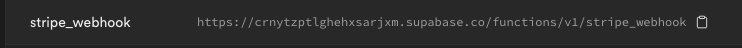
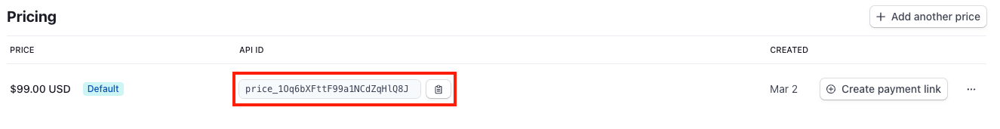

# Payments (Stripe)

## Setup

1. Create a stripe account and [set it up](https://support.stripe.com/topics/getting-started)
2. [Create a product](https://support.stripe.com/questions/how-to-create-products-and-prices)
3. Go to [portal settings](https://dashboard.stripe.com/settings/billing/portal) and click "Save Changes"
4. Go to Supabase dashboard > Edge Functions and copy the `stripe_webhooks` URL. It should look something like below:



5. [Add stripe webhook](https://docs.stripe.com/webhooks#add-a-webhook-endpoint), using the copied endpoint and the following event types:
   1. customer.subscription.deleted
   2. customer.subscription.updated
   3. customer.subscription.created
   4. checkout.session.completed
6. Get your [Stripe API secret key](https://support.stripe.com/questions/locate-api-keys-in-the-dashboard) and update `STRIPE_SECRET_KEY` in `supabase/.env`
7. Get the signing webhook signing secret and update `STRIPE_WEBHOOK_SIGNING_SECRET` in `supabase/.env`


8. Set your secrets in production

```bash
supabase secrets set --env-file supabase/.env
```

:::info
You can follow steps 1-7 in the [Stripe test environment](https://docs.stripe.com/test-mode) to have your local environment use the stripe test environment. Update `.env.local` instead of `.env`
:::

## Updating your Pricing Page

1. Go to the [product catalog](https://dashboard.stripe.com/products) and select a product
2. Copy the price id you want to add



3. Craft a URL from the flutter app in the format `https://YOUR_URL/payments?price=YOUR_PRICE`. For example:

```url
https://app.devtodollars.com/payments?price=price_1Oq6bXFttF99a1NCdZqHlQ8J
```

4. Update your pricing page with the URL

## Add Paywalls

You can check whether a user has purchased a product under `active_products` in the `stripe` table. See [stripe\_webhook](https://github.com/devtodollars/flutter-supabase-production-template/blob/main/supabase/functions/stripe\_webhook/index.ts) for the logic.

:::info
One-time purchases are never deleted from `active_products`
:::

:::info
Subscriptions are deleted from `active_products` when they are either not: active, trialing, or incomplete.
:::

1. Since the stripe product ids are stored in `active_products` we need to first retrieve the product id from stripe


2. In order to add the paywall, all you need to do is check if active\_products contains a particular stripe product id.&#x20;

```javascript
const activeProducts = ["prod_PfRUhnTnwtHLvw"]; // retrieved from stripe table
if (activeProducts.includes("prod_PfRUhnTnwtHLvw")) {
    // paywalled content goes here!
}
```

:::info
In Flutter, active products can be accessed in the [AppUser](https://github.com/devtodollars/flutter-supabase-production-template/blob/main/flutter/lib/models/app\_user.dart) model and is already fetched through [auth\_notifier.dart](https://github.com/devtodollars/flutter-supabase-production-template/blob/main/flutter/lib/services/auth\_notifier.dart)
:::
